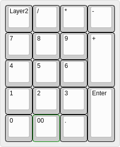
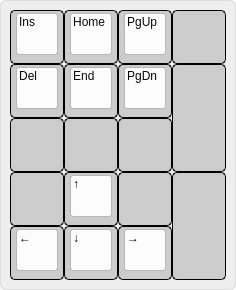

# The Yampad project repository

The Yampad project is an open-source, [QMK (Quantum Mechanical Keyboard Firmware)](https://github.com/qmk/qmk_firmware) powered, hot-swappable, RGB-backlighted, OLED featured, mechanical numpad. This repository will be used to share information about the project and instruction on how to use and assembly the Yampad.

**Designer's bio**: [Mattia Dal Ben (aka u/TiaMaT102)](mailto:matthewdibi@gmail.com) obtained a master's degree in Electrical Engineering with a specialization in Computer Science at the University of Udine. Currently works as a Software Engineer in R&D department for a big IoT and Embedded Computers company.

## Rationale

The Yampad is a Macropad/Numpad which uses Cherry MX style mechanical switches laid out in the usual numeric pad layout. The only difference comes from the bottom row, which uses a 4 keys configuration, thus enabling the use of the macropad as a nav cluster.

The name comes from the acronym: **Y**et **A**nother **M**echanical num**PAD**, referring to the disruptive and innovative nature of the project.

The main goal of this project is to have a cheap, easy-to-build, feature-rich numpad which is completely open source.

Features:
- Cheap to build.
- Easy to source components.
- Easy to build.
- Hot swappable keys using *Kailh PCB sockets*.
- Arduino Pro Micro powered.
- QMK compatible.
- RGB backlighting support (optional).
- OLED 0.91" screen (optional).
- Completely open-source.

## Default Layout

### Donations

If you've read this far and found something useful, please consider donating to help me maintain and further develop this project.

