<p align="center">


</p>

<h3 align="center">The Yampad project repository</h3>

<div align="center">

[]() 
[](https://github.com/mattdibi/yampad/issues)
[](https://github.com/mattdibi/yampad/pulls)
[](/LICENSE)

</div>

---

The Yampad project is an open-source, [QMK (Quantum Mechanical Keyboard Firmware)](https://github.com/qmk/qmk_firmware) powered, hot-swappable, RGB-backlighted, OLED featured, mechanical numpad. This repository will be used to share information about the project and instruction on how to use and assemble the Yampad.

<p align="center">
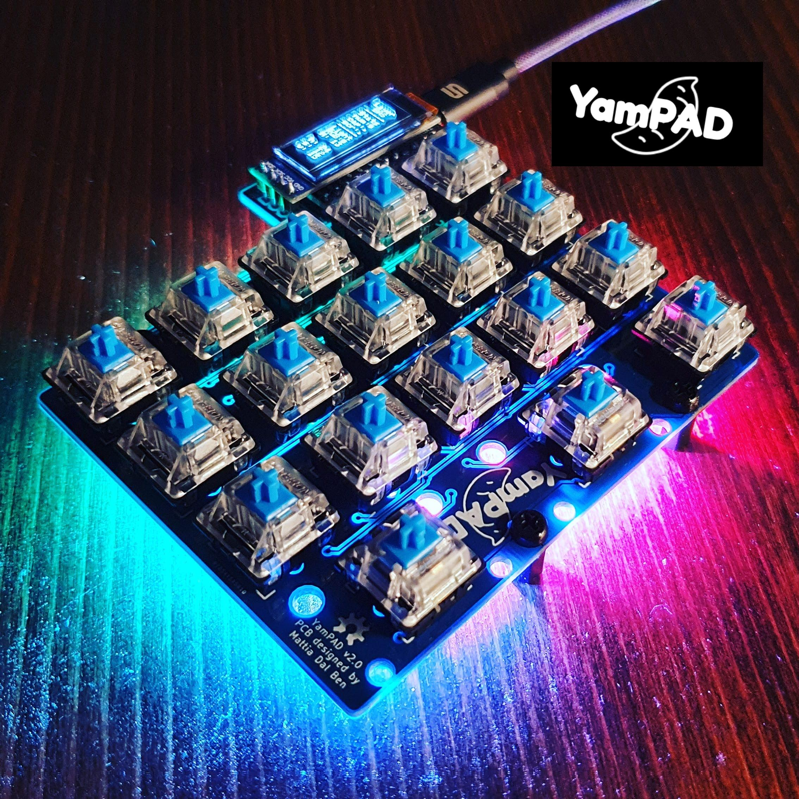
</p>

**Designer's bio**: [Mattia Dal Ben (aka u/TiaMaT102)](mailto:matthewdibi@gmail.com) obtained a master's degree in Electrical Engineering with a specialization in Computer Science at the University of Udine. Currently works as a Software Engineer in R&D department for a big IoT and Embedded Computers company.

## Table of contents

- [Rationale](#rationale)
- [Default Layout](#default-layout)
- [Bill of materials](#bill-of-materials)
- [Assembly guide](#assembly-guide)
- [Firmware](#firmware)

## Rationale

<p align="center">
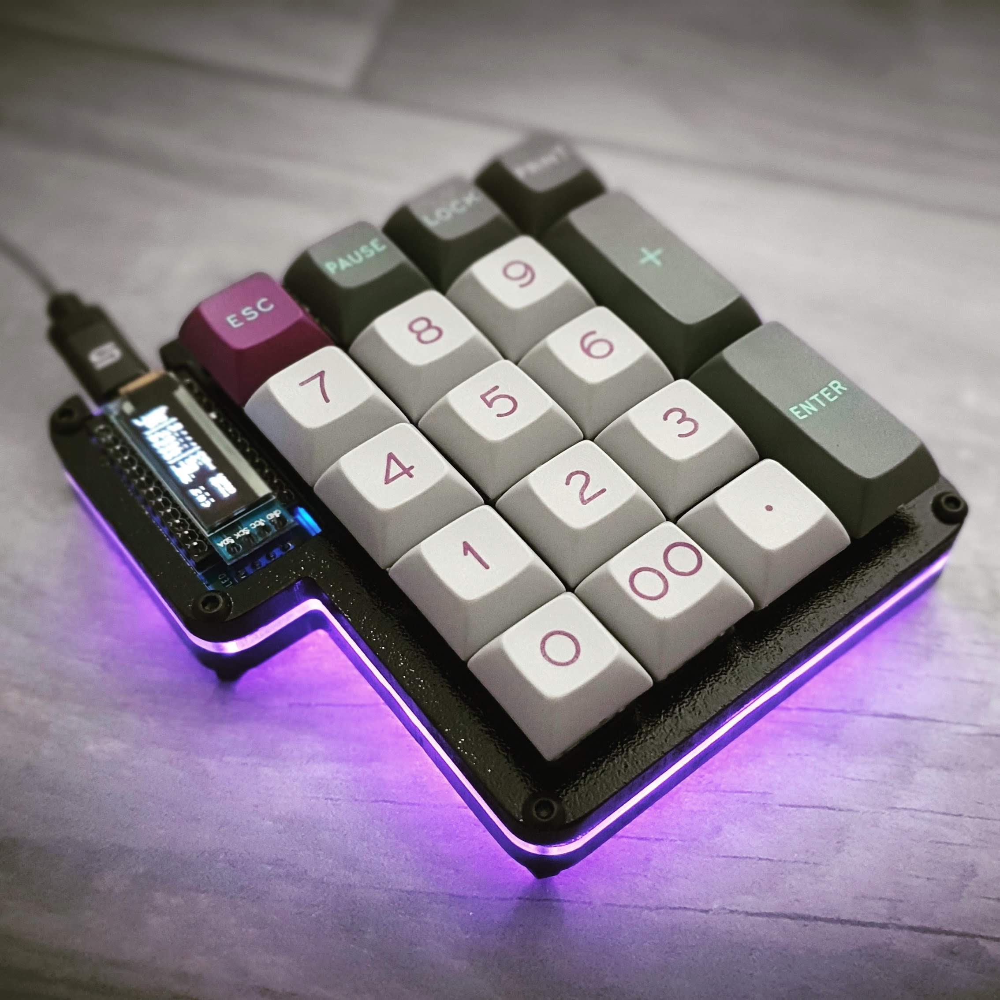
</p>

The Yampad is a Macropad/Numpad which uses Cherry MX style mechanical switches laid out in the usual numeric pad layout. The only difference comes from the bottom row, which uses a 4 keys configuration, thus enabling the use of the macropad as a nav cluster.

The name comes from the acronym: **Y**et **A**nother **M**echanical num**PAD**, referring to the disruptive and innovative nature of the project.

The main goal of this project is to have a cheap, easy-to-build, feature-rich numpad which is completely open source.

Features:
- Cheap to build: the PCB can be manufactured for less than 1$ per piece.
- Easy to source components.
- Easy to build.
- Hot swappable keys using *Kailh PCB sockets*.
- Arduino Pro Micro powered.
- QMK compatible.
- RGB backlighting support (optional).
- OLED 0.91" screen (optional).
- Completely open-source.

#### Useful links

- [YamPAD on Hackaday.io](https://hackaday.io/project/163491-yampad-feature-packed-open-source-macropad)

## Default Layout

<p align="center">
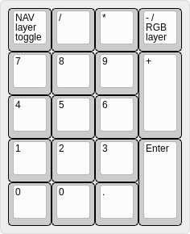
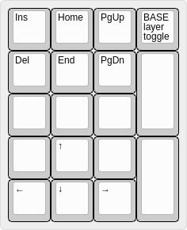
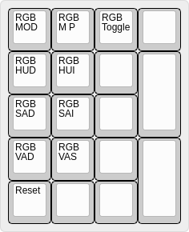
</p>

## Bill of materials

| Qty | Item                                 | Notes                                     |
|-----|--------------------------------------|-------------------------------------------|
| 1   | Arduino Pro Micro (ATmega32u4)       | a.k.a. SparkFun Pro Micro                 |
| 18  | Cherry MX compatible swtiches        |                                           |
| 18  | SOD-123 1N4148/1N4148W diodes        |                                           |
| 18  | Kailh PCB sockets CPG151101S11       |                                           |
| 9   | WS2812B RGB LEDs                     |                                           |
| 9   | SMD 0805 100nF capacitors            |                                           |
| 1   | I2C 0.91" 128*32 OLED Display Module | The ones using SSD1306 driver IC over I2C |
| 1   | 6mm*6mm button switch                |                                           |
| 1   | YamPAD PCB                           | [Order from PCBWay](https://www.pcbway.com/project/shareproject/YamPAD_mechanical_numpad.html) |
| 5   | M3 screws                            |                                           |

## Assembly guide

There's no wrong order for the YamPAD assembly with the exception of the Arduino/OLED/ResetButton. Here I will suggest an order because I found more comfortable to solder the components this way.

1. Start with soldering the **WS2812 LEDs**. Start by applying solder to a pad, then heat it up while adding the component, finally solder the remaining pads.
2. Now add the **0805 100nF caps**. Use the same technique as before.
3. Add the **1N4148 diodes**.
4. Add the **CPG151101S11 Kailh PCB sockets**.
5. Add the **reset 6mm button switch**.
6. Add some electrical tape just to be sure.
7. Add the **Arduino Pro Micro** bottom side up.
8. Add the **OLED screen**
9. Move to the firmware section and you should be set!

### Assembly details

#### Step 1: WS2812 assembly

<p align="left">The LEDs have a direction, this is indicated by a small cut out corner showing a triangle on the LED itself that must align with a corner indicated on the PCB as a visible corner angle. Top left on images below.</p>
<p align="center">
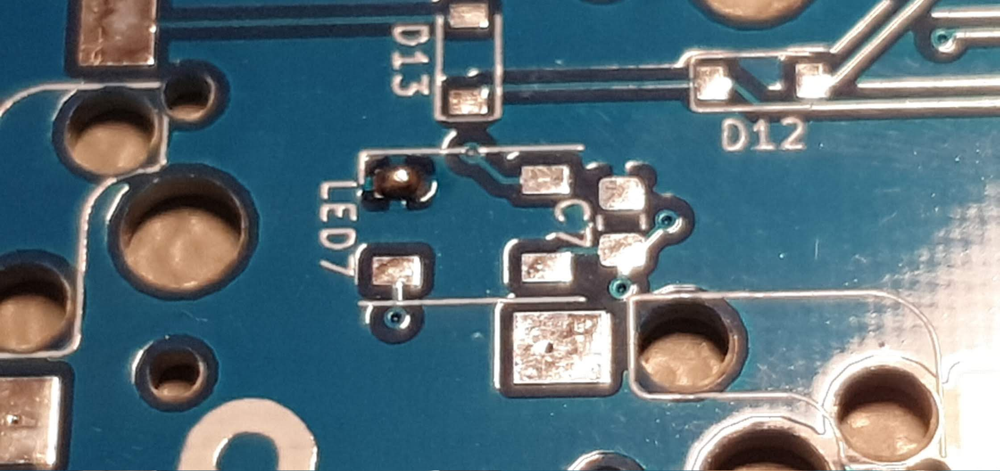
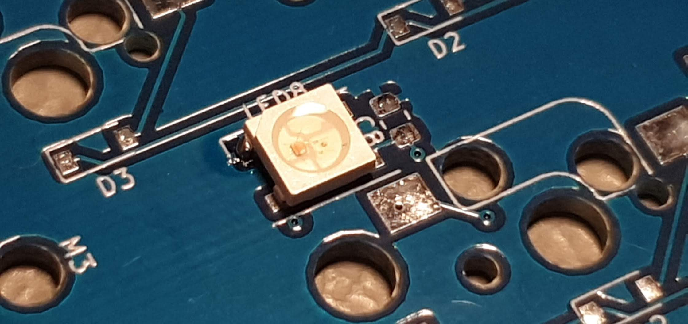
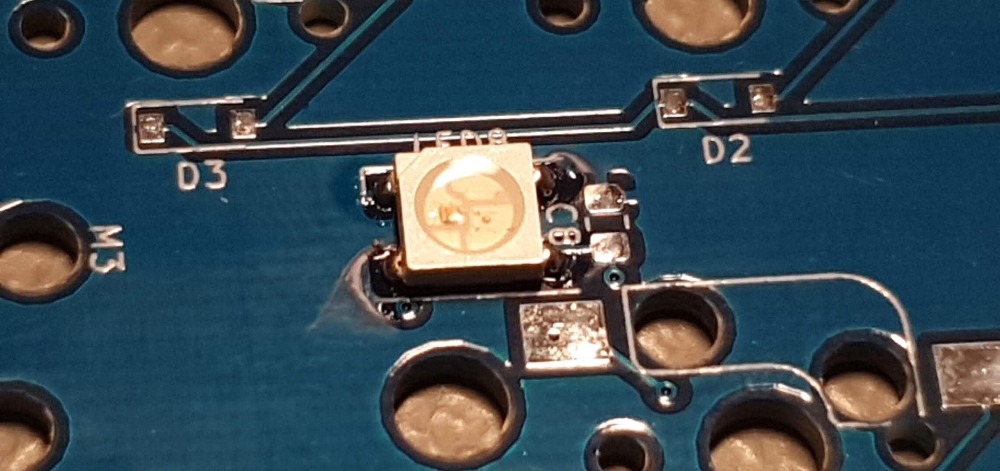
</p>

#### Step 2: Capacitors assembly

<p align="center">
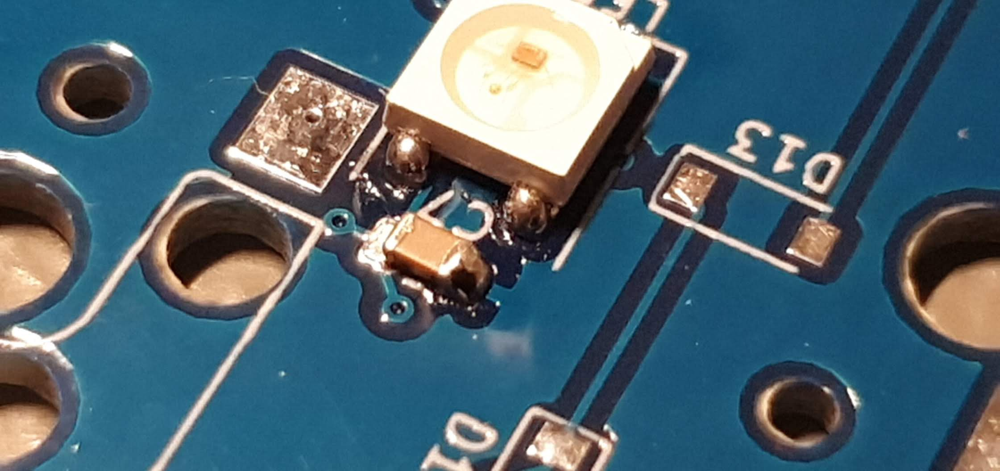
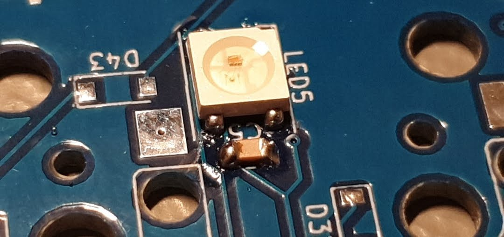
</p>

#### Step 3: Diodes assembly

<p align="left">The diodes have a direction, the side indicated by the line on the diode must align to the closed side of the shape on the PCB. Left on the three images below.</p>
<p align="center">
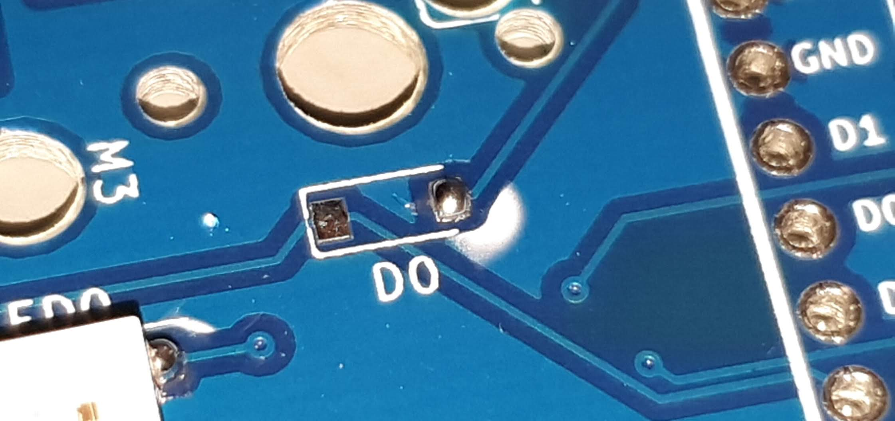
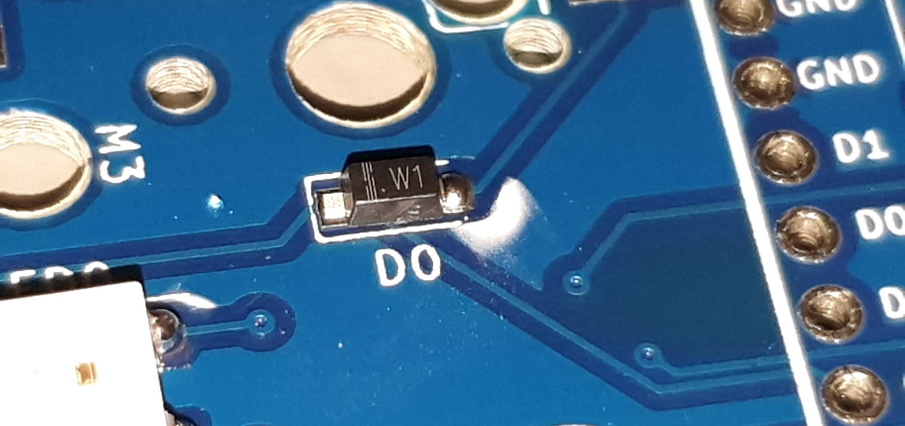
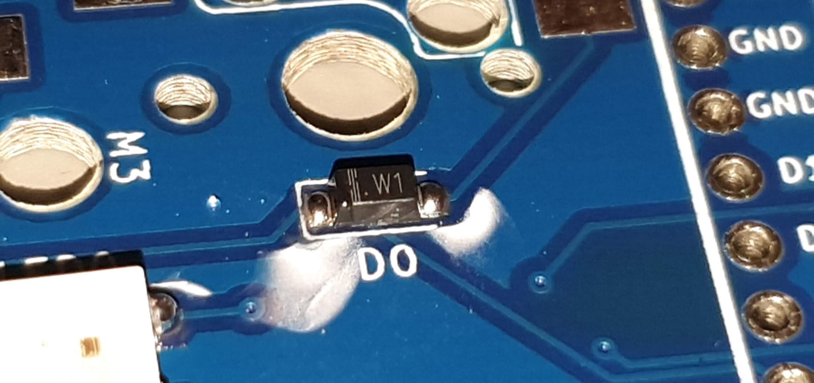
</p>

#### Step 4: Kailh PCB sockets assembly

<p align="center">
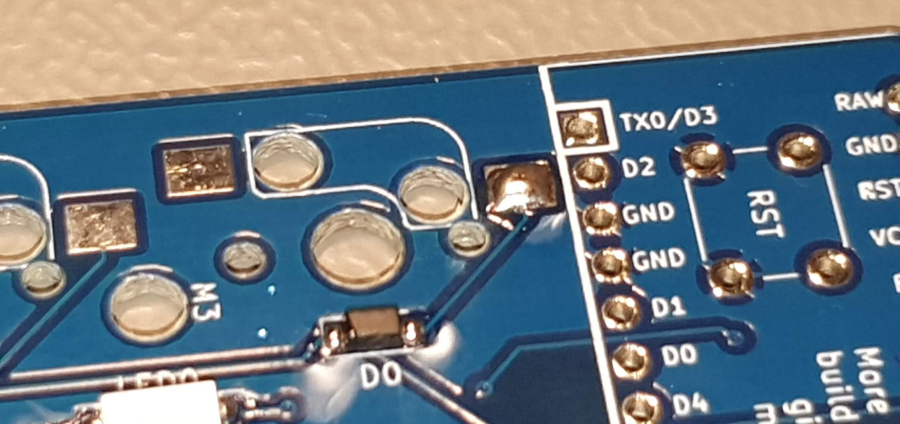
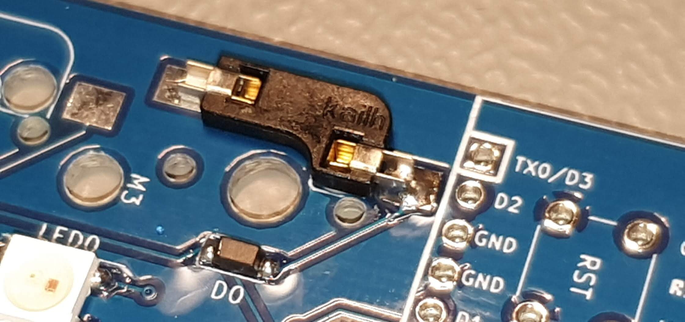
</p>

#### Step 5: Reset switch

<p align="center">
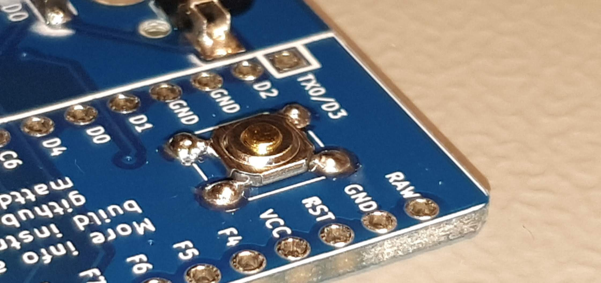
</p>

#### Step 6: Electrical tape

<p align="center">
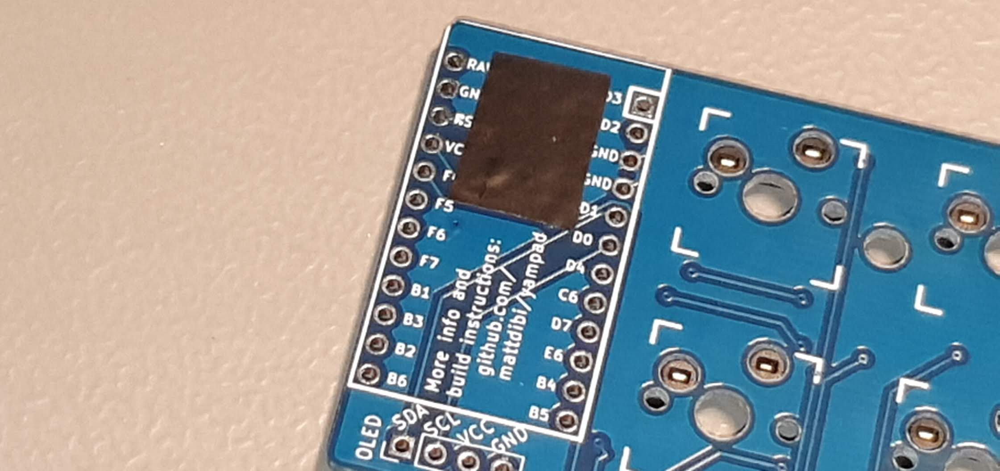
</p>

#### Step 7: Arduino assembly

<p align="center">
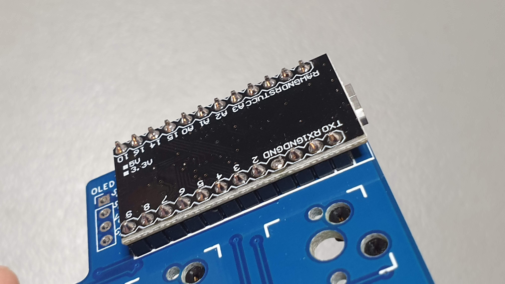
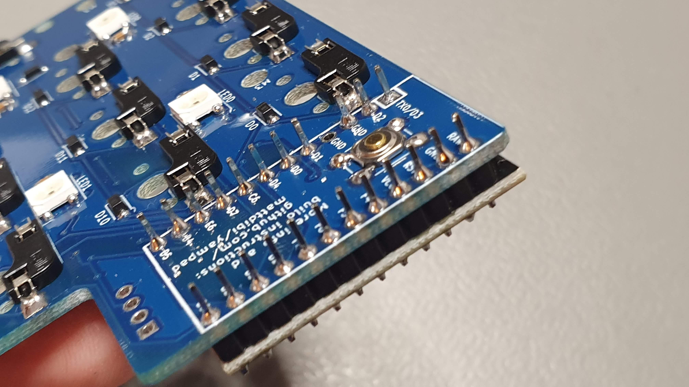
</p>

## Firmware

The firmware is available through [QMK firmware repository](https://github.com/qmk/qmk_firmware/tree/master/keyboards/yampad). Make example for this keyboard (after setting up your build environment):

```sh
make yampad:default
```

Example of flashing this keyboard:

```sh
make yampad:default:flash
```

See the [build environment setup](https://docs.qmk.fm/#/getting_started_build_tools) and the [make instructions](https://docs.qmk.fm/#/getting_started_make_guide) for more information. Brand new to QMK? Start with our [Complete Newbs Guide](https://docs.qmk.fm/#/newbs).

#### Pre-built

I also added a pre-built .HEX file in the 'firmware/' folder [here](https://github.com/mattdibi/yampad/tree/master/firmware) to test the electronics.

### Donations

If you've read this far and found something useful, please consider donating to help me maintain and further develop this project.

<p align="center">
<a href="https://www.paypal.me/MattiaDalBen"></a>
</p>
